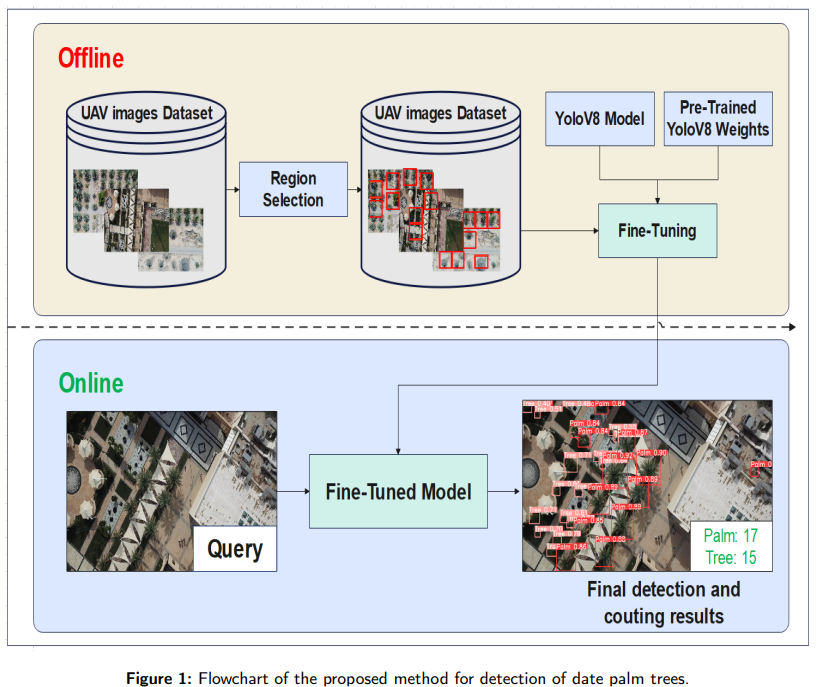

# Enhancing Palm Precision Agriculture: An Approach Based on Deep Learning and UAVs for Efficient Palm Tree Detection

This repository contains the implementation for the paper titled "Enhancing Palm Precision Agriculture: An Approach Based on Deep Learning and UAVs for Efficient Palm Tree Detection". The project uses the [Ultralytics YOLO framework](https://github.com/ultralytics/ultralytics.git) for object detection.


*Figure 1: Flowchart of the proposed method for detection of date palm trees.*

## Abstract

The palm sector plays a critical role in achieving the Sustainable Development Goals (SDGs). Accurate identification and counting of palm trees are vital for estimating yields, managing orchards, and planning future planting. This study aimed to develop an efficient method for detecting and locating individual palm trees using unmanned aerial vehicles (UAVs) equipped with remote sensing technology and deep learning algorithms.

We conducted a comparative evaluation of four variations of YOLOv5 (YOLOv5-6l, YOLOv5-L, and YOLOv5-L-HighAug), and one variation of YOLOv8 (YOLOv8-HighAug). These models were trained, validated, and tested on a dataset of palm tree images. The results show that YOLOv8-HighAug consistently outperformed the other models, achieving an Average Precision (AP) of 0.88, a precision of 0.87, and a recall of 0.86. YOLOv5-L-HighAug also exhibited high AP@50 values (0.83), making it suitable for precise detection tasks while balancing resource efficiency.

The proposed study reveals the potential of integrating deep learning algorithms with UAVs and remote sensing to revolutionize practices in the palm industry. By reducing human errors and increasing data collection speed, this approach offers significant benefits for accurate detection and management of palm trees in agricultural landscapes. In conclusion, embracing technology such as deep learning-based object detection can improve efficiency and sustainability within the palm industry. Implementing modern palm tree identification and mapping techniques can lead to improved decision-making, resource optimization, and successful achievement of SDGs in the palm sector.

## Prerequisites

Before you begin, ensure you have met the following requirements:

- Docker is installed on your machine. [Docker Installation Guide](https://docs.docker.com/get-docker/)
- You have a basic understanding of object detection concepts and Docker containerization.

## Dataset

The dataset used for training the YOLO model can be downloaded from the following URL:

- [Palm Tree Dataset URL](https://www.kaggle.com/datasets/yosrahajj/labeled-part-palm-counting-kharj/)

## Installation

To install the project, follow these steps:

1. Clone the repository to your local machine:

   ```
   git clone https://github.com/yosrahaj/Palm-Tree-Detection
   cd Palm-Tree-Detection
   ```
2. Build the Docker image:

   ```
   docker build -t my_yolo_app .
   ```

## Usage

Here's a quick guide on how to use the Docker container to run the training, evaluation, or data preparation scripts:

## Data Preparation

To prepare your data, you can run the `data_prep.py` script which will organize images and annotations correctly for YOLO training:

```
docker run -v /path/to/your/data:/app/data my_yolo_app python data_prep.py --source_folder /app/data --output_folder /app/outputs
```

## Training

To start training your YOLO model:

```
docker run -v /path/to/your/data:/app/data -v /path/to/your/outputs:/app/outputs my_yolo_app python train.py --model yolov8l.pt --data_config /app/data/config.yaml --epochs 60 --img_size 1280
```

## Evaluation

Evaluate your trained model:

```
docker run -v /path/to/your/outputs:/app/outputs my_yolo_app python eval.py --model /app/outputs/best.pt --data_config /app/data/config.yaml --img_size 1280
```

# Citation

```
bibtex reference
```
